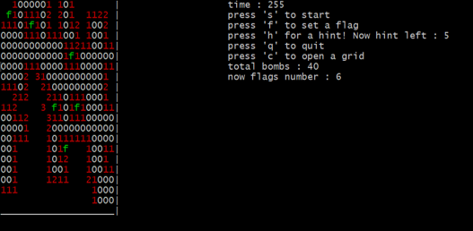

# Minesweeper-game
## a. 說明
此為使用ncurse做成的踩地雷小遊戲
## b. API 
### Class game_control
game_control() : 將之後環境設置(initscr(),cbreak(),noecho(),keypad(stdscr,TRUE))， 之後 call start_screen()，在呼叫 select()後結束。  

start_screen() : 此為開場畫面的配置，將 erase()、sleep()、printw()、refresh()做組合達到之眼睛動作的效果。 

select() : 用來讓使用者選擇難度，依據左右鍵將 EASY 與 HARD 的顏色做處理，而當使用者確定模式後，將 mode 變數依據游標位置做設定並將外框配置。  

final_control() : 此函式為遊戲結束時最後一個函式，依據 result 判斷遊戲的結果
狀態並顯示相對應的畫面，最後 sleep 五秒後遊戲即結束。

### Class game_playing 
game_playing() : 將 result 設為 3，游標位置做初始(x,y) = (0,0)，以及
flag_number 設為 0，之後依據 mode 去判斷長寬、炸彈、提示數和全部的格子
數。之後創一個存放 width 個整數的向量，然後用 for 迴圈將整個二維的空間設
置，然後顯示出提示頁面，之後呼叫 cursor_move()。

cursor_move() : 在此呼叫了 halfdelay()函式，目的是為了讓時間能正常運作，不
受使用者輸入影響，之後開始進入 while 迴圈，而跳出迴圈有三個原因，一個
是 win_or_lose 為 false(使用者碰到地雷並將 result 設 0)、一個是 total = 0(代表
使用者過關並將 result 設 1) 以及使用者點選’q’退出遊戲，若以上皆不滿足，則
依據使用者操控的鍵盤指令去做應對，當使用者超過 0.1 秒未做任何指令時，
程式回自動將 ERR 給予輸入的變數，用此去不斷更新時間，而其他鍵盤指令也
會做時間更新的動作。當第一次點擊 grid 時，呼叫 game_random()做遊戲內部
的設置，在這時才做設置是因為第一步不會是地雷，之後更新 total，然後呼叫
BFS()，最後開始計時，而之後的每一次點擊 grid 都會依據 gameover_detection
去決定是否踩到地雷。  

gameover_detection() : 依據使用者輸入的指令去做對應的動作，若使用者按
了’h’，代表要進行提示，先判斷提示(help)是否還有，若有，則隨機產生座標直
到該座標上未被掀起以及不是炸彈，之後將 help 減一並回傳 true，若沒有提
示，則不做任何動作直接回傳 true。若使用者對已經掀起的 grid 做點擊時，也
是不做任何ˊ動作直接回傳 true。若使用者點擊’c’時，判斷該座標是否為炸
彈，若是，回傳 false，否則呼叫 BFS()並回傳 true。若使用者點擊’f’，先判斷載
名叫 flag 的 set 中有無此座標，再依有無去進行 flag_number 的增減與顯示並回
傳 true。

BFS() : 此為加分題程式碼，先判斷傳進來的最標是否為 0，若不是，則將開
grid 顯示後直接回傳，而若該座標已被掀開，也直接回傳。若該座標為 0，將該
座標放入 queue 中，之後進入 while 迴圈，將座標周圍的八個點做判斷，若為 0
則放入 queue 中，否則顯示數字，當 queue 為空時代表顯示即完成。

game_random(): 此為設置遊戲內部的函式，而傳入的兩個參數為使用者第一次
點擊的座標，之後開始隨機生成炸彈，將生成的炸彈座標放入 set 和 queue(為
下階段用)中以免重複(炸彈座標不為使用者點擊座標)，當 while 迴圈結束即完成
炸彈生成。進入下一階段，從 queue 中一一取出炸彈座標，並將其周圍的數字
加 1，當 queue 為空時即為成設置，最後將結果輸出到 Mine.txt。
## c. 遊戲畫面 
 